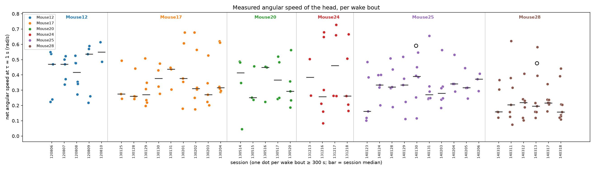
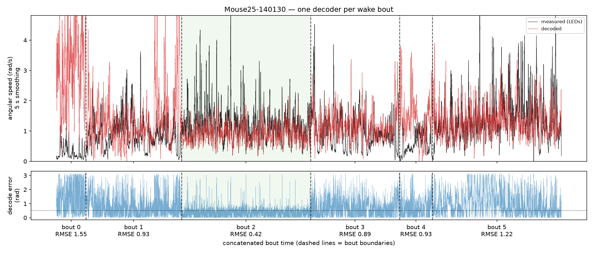
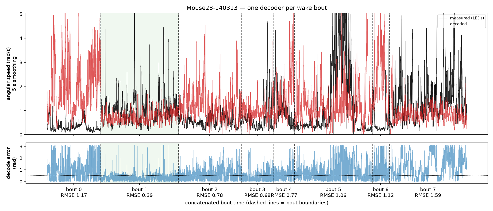

2026-08-05

<!-- GENERATED from results_angular1.in — do not edit; edit the .in and re-run `hd-exp render`. -->

# angular1 — results

> **Question.** How fast does the head-direction signal turn, in wake and in REM, across animals
> and sessions?

Methods: [`instructions-angular1.md`](../exp_instructions/instructions-angular1.md).

## Headline

Two findings, and they point opposite ways.

**The cell-pair estimator does not work on this data.** Across 32 wake sessions where the
answer is independently known from the tracking LEDs, the correlation between estimate and truth is
**ρ = -0.133 (p = 0.47)**. The per-session speeds in
[exp1](#angular1_exp1--the-speeds-themselves) should not be used.

**Angular speed read off the decoded ring angle does work — where the decode is verified.** On the
2 wake bouts whose own held-out decode clears the 0.5 rad bar, decoded angular speed is
**1.02×** the measured speed. That is the route to a usable number, and it comes with
a quality gate the correlogram route never had.

The first finding is reported rather than buried because the numbers are not self-evidently broken.
They come with a plausible REM/wake ratio and apparent differences between animals, and a per-session
value like 0.20 rad/s invites interpretation rather than suspicion. Nothing in them warns
that they are not measuring head speed; the validation is the only thing that does.

**32 sessions from 6 mice** for exp1/exp2, ADn cells only; exp3 covers
14 wake bouts from the sessions run so far.

---

## angular1_exp2 — the validation

During wake the head angle is measured from the tracking LEDs, so the answer is independently known.
The comparison is against the **net** angular speed at τ = 1.00 s — the displacement
between the two ends of a window, divided by its length — because that is what the correlogram model
reads. Path length, mean |dθ/dt|, counts a head that turns left then right twice and is an upper
bound on the net speed; comparing against it would make a difference of definition look like a fault
in the estimator, so both are shown.

| ground truth | ρ with the estimate | p | estimate ÷ truth | within 2× |
|---|---|---|---|---|
| net displacement at τ = 1.00 s | **-0.133** | 0.47 | 0.42 (0.28 – 0.86) | 10 / 32 |
| path length | 0.131 | 0.48 | 0.12 (0.06 – 0.25) | 2 / 32 |

That the net and path-length rows differ is expected and measurable: net speed falls as the window
lengthens, because more of the head's motion cancels inside it.

| tau_s | measured_net_speed |
|---|---|
| 0.25 | 1.18 |
| 0.50 | 0.80 |
| 1.00 | 0.51 |
| 2.00 | 0.34 |

### The spread is the clearest symptom

| | range across sessions | fold |
|---|---|---|
| measured net speed | 0.28 – 0.83 rad/s | 3× |
| estimate | 0.07 – 5.96 rad/s | 88× |

Real animals differ in head speed by a factor of about 3. The estimate varies by
88×, and none of that variation is the animal. A number moving far more than the
quantity it claims to measure is moving for another reason.

### It is not a sampling problem

If the failure were noise, restricting to sessions with more tuned cells should help. It does not:

| min_tuned_cells | sessions | rho |
|---|---|---|
| 0 | 32 | -0.133 |
| 10 | 28 | -0.075 |
| 15 | 23 | -0.005 |
| 20 | 17 | -0.098 |

Nor is the estimate tracking an obvious artefact of sampling — cell count (ρ = 0.063,
p = 0.73) and pair count (ρ = 0.063, p = 0.73).

### Pooling the pairs did not rescue it

The first implementation fitted each cell pair alone and took the median. Its per-pair estimates
scattered by **5.2×** their own median — the single-pair fit is close to
uninformative — so the session number was being set by whichever tail of failed fits happened to
dominate. The current estimator instead fits one speed across all pairs at once, which on synthetic
data is robust to adding as many uninformative pairs as real ones.

It changed the answer without fixing it: the two estimators agree with each other at
ρ = 0.581, and the pairwise one validates at ρ = -0.113
(p = 0.54) against the truth's -0.133. Both fail, so the fault is not in how
the pairs are combined.

---

## angular1_exp4 — how fast does the head actually turn?

The measured answer, from the tracking LEDs alone: no decoder, no estimator, nothing contingent.
**194 wake bouts of at least 300 s, across 39 sessions from
6 mice.**

Median net angular speed at τ = 1.00 s is **0.31 rad/s** (IQR
0.22–0.45).

| mouse | sessions | bouts | median | lo | hi |
|---|---|---|---|---|---|
| 12 | 5 | 23 | 0.48 | 0.22 | 0.61 |
| 17 | 9 | 42 | 0.31 | 0.17 | 0.68 |
| 20 | 5 | 19 | 0.35 | 0.04 | 0.56 |
| 24 | 4 | 17 | 0.27 | 0.08 | 0.73 |
| 25 | 10 | 49 | 0.32 | 0.10 | 0.66 |
| 28 | 6 | 44 | 0.21 | 0.07 | 0.62 |

### Bouts within a session differ more than animals do

| comparison | spread |
|---|---|
| between bouts within a session (median max/min) | **2.6×** |
| between animals (max/min of per-animal medians) | 2.3× |

Animals do differ (Kruskal-Wallis p = 3.7e-07), but the three-level variance split says
how little that is worth:

| level | share of variance in log speed |
|---|---|
| between mice | **17.7%** |
| between sessions within a mouse | 0.0% |
| **between bouts within a session** | **82.3%** |

ICC = 0.177. So how fast an animal turns its head is mostly **not** a property of the
animal — it is a property of what the animal happened to be doing in that bout. Session identity
explains essentially nothing once the bout is accounted for.

This matters beyond angular speed. It is the ground-truth quantity, measured with no decoder in the
way, and it sets a reference for what a between-animal ICC looks like for something that is largely
*behavioural* rather than intrinsic. Any metric claiming a much higher ICC has to explain why it is
more animal-specific than the behaviour it is measured during.

**Figure — Measured net angular speed of every wake bout, by animal and session (open circles: decoded speed where the decode is verified)** (`angular1_exp4_measured_speed_by_animal.png`)

---

## angular1_exp3 — where the failure actually is

exp2 says the estimate does not track measured head speed. It cannot say whether the decode or the
cell-pair estimator is at fault. exp3 fits **one decoder per wake bout**, each with its own held-out
RMSE against measured head direction, and then measures three angular speeds on the same bout:
measured (LEDs), decoded (the bout's own ring angle), and correlogram (the cell-pair estimator).

**14 wake bouts** of at least 300 s across the sessions run so far; **2**
have a decode good enough to trust (held-out RMSE below 0.5 rad, the published bar; chance is
π/√3 = 1.81).

| session_id | bout_index | duration_s | rmse | usable | measured_net | decoded_net | measured_path | decoded_path | correlogram_speed |
|---|---|---|---|---|---|---|---|---|---|
| Mouse25-140130 | 0 | 342.00 | 1.55 | False | 0.11 | 1.19 | 0.31 | 3.17 | nan |
| Mouse25-140130 | 1 | 1112.00 | 0.92 | False | 0.38 | 0.61 | 0.84 | 1.38 | 1.92 |
| Mouse25-140130 | 2 | 3543.00 | 0.40 | True | 0.58 | 0.59 | 1.08 | 0.93 | 2.41 |
| Mouse25-140130 | 3 | 1036.00 | 0.87 | False | 0.39 | 0.60 | 0.92 | 1.19 | 2.00 |
| Mouse25-140130 | 4 | 381.00 | 0.93 | False | 0.25 | 0.65 | 0.59 | 1.40 | 2.50 |
| Mouse25-140130 | 5 | 2083.00 | 1.19 | False | 0.57 | 0.78 | 1.10 | 1.34 | 2.16 |
| Mouse28-140313 | 0 | 1043.00 | 1.17 | False | 0.12 | 0.77 | 0.35 | 2.03 | 4.22 |
| Mouse28-140313 | 1 | 3875.00 | 0.37 | True | 0.46 | 0.48 | 0.90 | 0.74 | 1.91 |
| Mouse28-140313 | 2 | 1214.00 | 0.78 | False | 0.21 | 0.47 | 0.55 | 1.24 | 1.69 |
| Mouse28-140313 | 3 | 630.00 | 0.65 | False | 0.16 | 0.35 | 0.46 | 0.93 | 0.33 |
| Mouse28-140313 | 4 | 403.00 | 0.77 | False | 0.19 | 0.55 | 0.76 | 1.63 | 0.72 |
| Mouse28-140313 | 5 | 2520.00 | 0.88 | False | 0.24 | 0.43 | 1.02 | 1.28 | 0.26 |
| Mouse28-140313 | 6 | 333.00 | 1.11 | False | 0.15 | 0.96 | 0.53 | 2.35 | nan |
| Mouse28-140313 | 7 | 1719.00 | 1.58 | False | 0.57 | 0.54 | 1.29 | 0.86 | 2.41 |

### The decode is fine when the bout is one behaviour

Median RMSE is 0.387 on the bouts that pass and 0.922 on those that do not.
The bouts that pass are the long behavioural sessions; the ones that fail are wake in the rest box,
where the animal barely turns its head, the ring is never traversed, and there is nothing for the
manifold fit to recover. Pooling those together — which is what the rest of this repo does — is what
produced the 0.97–1.48 rad decode that started this investigation.

On bouts whose decode passes, decoded angular speed is **1.02×** the measured speed
— a median absolute error of 0.01 rad/s, against 0.24 rad/s on the
bouts that fail. **Angular speed read straight off a verified decode is the measured speed.**

That comparison is made on **net** displacement at a fixed lag, not on path length, and the choice is
not cosmetic. Path length is not a well-defined property of the head: decimating the same wake bout
from 39 Hz to 2.4 Hz drops it by a factor of 2.4, because finer sampling accumulates more tracking
jitter, while net speed at tau = 1 s moves by under 2%. On the same bouts the path-length ratio is
0.84×, which would read as a decoder that systematically under-reports when it
is really the two signals being measured at different effective bandwidths.

On the bouts that fail, decoded speed runs *above* measured — a bad decode jumps around, and those
jumps read as fast turning. Worth carrying into REM, where no RMSE is available to catch it: a
broken decode there will report a fast bump, not a slow one.

### The cell-pair estimator is the broken part

On those same bouts the correlogram estimator comes out at **4.14×** the
measured speed. Worse than the offset is that it barely responds to the truth: across these bouts
measured speed varies 5.1× and the correlogram estimate varies
16.4×, not in step with it.

That settles what exp2 could not. The decode carries the angular speed; the estimator built on top
of it loses it. Any future angular-velocity number should be read off a decode with a quality
number attached, not from cell-pair correlograms.

**Figure — Mouse25-140130: measured and decoded angular speed, one decoder per wake bout (green = decode passes the 0.5 rad bar)** (`angular1_exp3_traces_Mouse25-140130.png`)

**Figure — Mouse28-140313: measured and decoded angular speed, one decoder per wake bout (green = decode passes the 0.5 rad bar)** (`angular1_exp3_traces_Mouse28-140313.png`)

### What is likely wrong with the estimator

Diagnosed but not fixed, in decreasing order of confidence:

1. **Slow shared rate fluctuation.** Firing rates co-vary on timescales of seconds for reasons
   unrelated to turning, and the model cannot tell that from a very slow sweep. Left uncorrected it
   pinned sessions at the bottom of the search grid (one session returned 0.05 rad/s, the grid
   minimum, against a measured 0.63). Rates are now high-passed at 5 s and lags capped at 1 s, which
   removed the pinning but not the failure.
2. **Wake is not one behaviour.** A session mixes long immobile stretches with brief fast turns, and
   the estimator returns a single number for all of it. Which part dominates the correlogram is not
   controlled, and it need not be the same part in every session.
3. **One speed per session may be the wrong object.** The model assumes a χ²(3) *distribution* of
   speeds with one free mean. If the real distribution is bimodal — still, versus turning — its mean
   is not what the correlogram shape reports.

## angular1_exp1 — the speeds themselves

Recorded for completeness. Given the section above, **the between-animal comparison this question
was for cannot be made from these numbers.**

| state | median (rad/s) | IQR |
|---|---|---|
| wake | 0.20 | 0.14 – 0.47 |
| REM | 0.17 | 0.12 – 0.32 |

In the 32 sessions estimated in both states, REM comes out at 0.84× the wake
speed; REM is higher in 10 of 32, Wilcoxon p = 0.0026.

The ratio is the *least* damaged quantity here — both states pass through identical machinery with
the same tuning curves, so a multiplicative bias divides out — but a shared bias is not the failure
mode observed, so this is not a defence of it either.

### By animal

| mouse | sessions | wake | rem | tuned |
|---|---|---|---|---|
| 12 | 5 | 0.17 | 0.16 | 40.00 |
| 17 | 9 | 0.32 | 0.19 | 25.00 |
| 20 | 5 | 0.37 | 0.19 | 8.00 |
| 24 | 3 | 0.17 | 0.11 | 16.00 |
| 25 | 6 | 0.15 | 0.17 | 17.50 |
| 28 | 4 | 2.63 | 1.38 | 21.50 |

### By session

| session_id | n_tuned | awake_speed | awake_speed_pairwise | rem_speed | measured_wake_net | measured_wake_speed |
|---|---|---|---|---|---|---|
| Mouse12-120806 | 39 | 0.17 | 0.23 | 0.16 | 0.63 | 2.65 |
| Mouse12-120807 | 40 | 0.37 | 0.79 | 0.37 | 0.65 | 2.80 |
| Mouse12-120808 | 39 | 0.14 | 0.39 | 0.11 | 0.83 | 4.12 |
| Mouse12-120809 | 49 | 0.12 | 0.59 | 0.10 | 0.71 | 3.23 |
| Mouse12-120810 | 44 | 0.22 | 0.55 | 0.17 | 0.77 | 3.82 |
| Mouse17-130125 | 3 | 0.09 | 1.50 | 0.41 | 0.43 | 1.56 |
| Mouse17-130128 | 19 | 3.11 | 0.98 | 0.19 | 0.47 | 1.97 |
| Mouse17-130129 | 25 | 0.32 | 0.78 | 0.30 | 0.59 | 2.75 |
| Mouse17-130130 | 25 | 0.14 | 0.50 | 0.14 | 0.60 | 2.60 |
| Mouse17-130131 | 22 | 0.18 | 1.28 | 0.14 | 0.48 | 1.82 |
| Mouse17-130201 | 26 | 0.71 | 1.28 | 0.39 | 0.53 | 1.93 |
| Mouse17-130202 | 25 | 0.26 | 1.42 | 0.15 | 0.50 | 1.95 |
| Mouse17-130203 | 26 | 3.43 | 1.71 | 0.10 | 0.43 | 2.05 |
| Mouse17-130204 | 23 | 0.46 | 0.80 | 0.21 | 0.59 | 2.60 |
| Mouse20-130514 | 5 | 0.94 | 0.77 | 0.35 | 0.48 | 2.01 |
| Mouse20-130515 | 6 | 0.18 | 0.29 | 0.19 | 0.67 | 3.07 |
| Mouse20-130516 | 8 | 0.07 | 0.09 | 0.10 | 0.70 | 3.32 |
| Mouse20-130517 | 16 | 0.64 | 0.95 | 0.47 | 0.60 | 2.48 |
| Mouse20-130520 | 10 | 0.37 | 1.50 | 0.11 | 0.70 | 3.63 |
| Mouse24-131216 | 14 | 0.10 | 1.38 | 0.10 | 0.56 | 1.84 |
| Mouse24-131217 | 16 | 0.17 | 1.12 | 0.11 | 0.56 | 1.74 |
| Mouse24-131218 | 16 | 0.24 | 0.51 | 0.19 | 0.56 | 1.74 |
| Mouse25-140124 | 10 | 0.50 | 0.63 | 0.38 | 0.38 | 1.75 |
| Mouse25-140130 | 17 | 0.26 | 0.81 | 0.29 | 0.40 | 1.07 |
| Mouse25-140131 | 20 | 0.14 | 0.26 | 0.17 | 0.40 | 1.12 |
| Mouse25-140204 | 22 | 0.16 | 0.19 | 0.17 | 0.38 | 1.11 |
| Mouse25-140205 | 18 | 0.12 | 0.19 | 0.12 | 0.35 | 0.97 |
| Mouse25-140206 | 14 | 0.13 | 0.21 | 0.13 | 0.38 | 1.07 |
| Mouse28-140311 | 13 | 5.11 | 3.70 | 3.51 | 0.33 | 1.26 |
| Mouse28-140313 | 24 | 0.11 | 0.28 | 0.10 | 0.28 | 0.93 |
| Mouse28-140317 | 20 | 0.15 | 0.57 | 0.15 | 0.35 | 1.96 |
| Mouse28-140318 | 23 | 5.96 | 1.63 | 2.60 | 0.33 | 1.90 |

---

## What was verified, and what that establishes

`tests/test_angular_speed.py` runs the whole estimator on synthetic spikes generated at a **known**
angular speed: recovery within a factor of two at 0.5, 1, 3 and 6 rad/s, correct ordering across the
four, and — for the joint fit — stability when as many uninformative pairs as real ones are mixed
in. `tests/test_head_direction.py` checks the ground truth itself: net and path-length speed agree
when nothing reverses, net falls below path length when the head does reverse, net falls with the
window, and neither reads a wrap across 2π as a full turn.

Those tests found four real bugs, each of which had produced plausible-looking numbers: a rotation
applied in the wrong direction, a cost function that rewarded implausibly fast speeds because
Poisson noise shrinks correlations, a lag window too short for the speed being fitted, and the
single-pair fit's one-sided failure.

So the implementation does what the method says. **The method, applied to these recordings, does not
recover the quantity it is supposed to** — which is exactly the thing only a comparison against
measured ground truth could have revealed, and the reason `angular1_exp2` exists.

## Provenance

Generated 2026-08-05T22:57:26+00:00 from commit `cb89022`.

| config | value |
|---|---|
| `cell_areas` | `['ADn']` |
| `detrend_s` | `5.0` |
| `dt` | `0.02` |
| `max_lag_s` | `1.0` |
| `measured_min_bout_s` | `300.0` |
| `measured_smooth_s` | `0.1` |
| `merge_gap_s` | `0.0` |
| `mice` | `[12, 17, 20, 24, 25, 28]` |
| `min_bout_s` | `300.0` |
| `min_pairs` | `3` |
| `min_peak_rate_hz` | `1.0` |
| `min_rho` | `0.3` |
| `n_hd_bins` | `60` |
| `n_restarts` | `5` |
| `n_splits` | `3` |
| `net_taus_s` | `[0.25, 0.5, 1.0, 2.0]` |
| `rmse_threshold` | `0.5` |
| `seed` | `0` |
| `sessions` | `[]` |
| `speed_model` | `chi2_3` |
| `stages` | `['sessions', 'bouts', 'measured']` |
| `states` | `['Awake', 'REM']` |
| `trace_smooth_s` | `5.0` |
| `train_frac` | `0.8` |
| `validation_tau_s` | `1.0` |

| input | value |
|---|---|
| `figures` | `{'FIG_BOUT_TRACE_Mouse25_140130': 'outputs/figures/angular1_exp3_traces_Mouse25-140130.png', 'FIG_BOUT_TRACE_Mouse28_140313': 'outputs/figures/angular1_exp3_traces_Mouse28-140313.png', 'FIG_MEASURED_BY_ANIMAL': 'outputs/figures/angular1_exp4_measured_speed_by_animal.png'}` |
| `input_sessions` | `32` |
