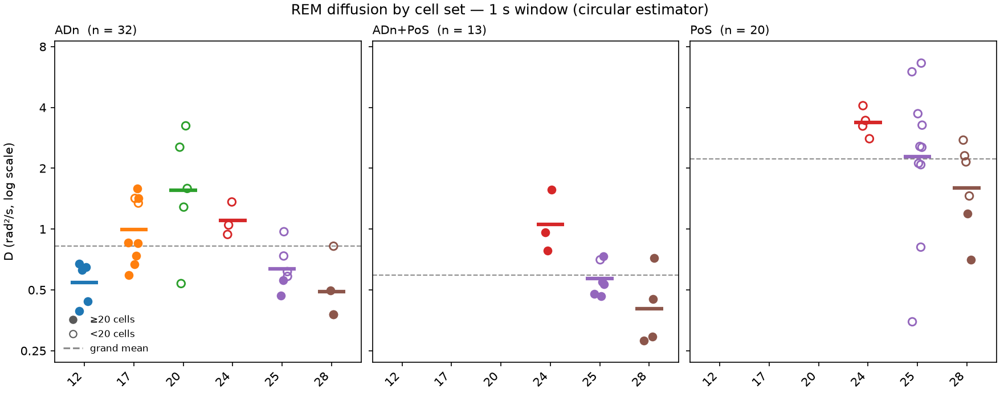
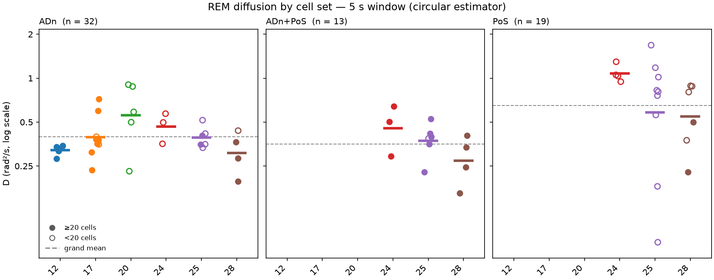

2026-08-04

<!-- GENERATED from results_diffusion1.in — do not edit; edit the .in and re-run `hd-exp render`. -->

# diffusion1 — results

> **Question.** *D* is defined as the slope of ⟨Δα²⟩ against lag, fitted over the first 200 ms.
> Does the answer change if the same quantity is measured over 500 ms, or 5 s?

Methods: [`instructions-diffusion1.md`](../exp_instructions/instructions-diffusion1.md).

**32 ADn sessions.** All values from the `circular` estimator unless stated.

---

## diffusion1_exp1 — D at every window

| window_ms | median_D | ratio_to_reference |
|---|---|---|
| 200 | 0.901 | 1.000 |
| 500 | 0.871 | 0.917 |
| 1000 | 0.738 | 0.721 |
| 2000 | 0.551 | 0.516 |
| 3000 | 0.458 | 0.420 |
| 4000 | 0.411 | 0.365 |
| 5000 | 0.361 | 0.327 |

- 200 ms → 500 ms: ratio **0.92** (median)
- 200 ms → 5000 ms: ratio **0.33**, IQR
  0.25–0.58
- correlation between a session's speed and how far it falls: ρ = **-0.891**
  (p = 7.8e-12)

The dimensionless shape of the curve, which no multiplicative estimator bias can affect:

| estimator | α over 0.1–0.5 s | α over 1–5 s |
|---|---|---|
| `wrapped` | 0.87 | 0.41 |
| `circular` | **0.93** | **0.53** |

Wrapping, for context: the naive estimator has run to a median **0.51** of its own
π²/3 ceiling by the longest lag (worst 0.81). Surviving angular correlation at that lag
spans 0.164–0.652, so the circular estimator is still sensitive throughout.

| session_id | n_cells | D_200 | D_5000 | ratio |
|---|---|---|---|---|
| Mouse17-130125 | 3 | 2.377 | 0.352 | 0.148 |
| Mouse20-130514 | 5 | 5.881 | 0.876 | 0.149 |
| Mouse17-130128 | 19 | 2.603 | 0.397 | 0.153 |
| Mouse25-140124 | 10 | 1.819 | 0.334 | 0.183 |
| Mouse20-130516 | 9 | 2.546 | 0.587 | 0.231 |
| Mouse20-130515 | 6 | 3.897 | 0.903 | 0.232 |
| Mouse24-131217 | 16 | 1.503 | 0.355 | 0.236 |
| Mouse20-130517 | 16 | 2.042 | 0.499 | 0.245 |
| Mouse17-130202 | 25 | 1.266 | 0.311 | 0.246 |
| Mouse17-130201 | 26 | 2.338 | 0.599 | 0.256 |
| Mouse17-130204 | 23 | 0.901 | 0.235 | 0.261 |
| Mouse24-131216 | 14 | 2.145 | 0.571 | 0.266 |
| Mouse28-140317 | 20 | 0.658 | 0.196 | 0.298 |
| Mouse20-130520 | 10 | 0.764 | 0.230 | 0.302 |
| Mouse24-131218 | 16 | 1.589 | 0.497 | 0.313 |
| Mouse17-130203 | 28 | 1.157 | 0.376 | 0.325 |
| Mouse17-130129 | 25 | 1.085 | 0.357 | 0.329 |
| Mouse12-120808 | 39 | 0.892 | 0.338 | 0.379 |
| Mouse17-130131 | 22 | 1.888 | 0.721 | 0.382 |
| Mouse12-120807 | 40 | 0.805 | 0.317 | 0.393 |
| Mouse12-120806 | 39 | 0.808 | 0.332 | 0.411 |
| Mouse17-130130 | 26 | 0.844 | 0.381 | 0.451 |
| Mouse28-140311 | 14 | 0.901 | 0.437 | 0.485 |
| Mouse25-140206 | 14 | 0.660 | 0.352 | 0.534 |
| Mouse25-140130 | 17 | 0.733 | 0.516 | 0.703 |
| Mouse25-140131 | 20 | 0.550 | 0.404 | 0.735 |
| Mouse25-140204 | 22 | 0.438 | 0.351 | 0.800 |
| Mouse25-140205 | 18 | 0.519 | 0.417 | 0.804 |
| Mouse12-120809 | 49 | 0.344 | 0.281 | 0.818 |
| Mouse28-140318 | 23 | 0.437 | 0.365 | 0.835 |
| Mouse12-120810 | 44 | 0.377 | 0.344 | 0.912 |
| Mouse28-140313 | 24 | 0.261 | 0.282 | 1.082 |

### Interpretation

**200 ms and 500 ms are the same measurement.** A ratio of 0.92 means anyone
choosing between those two windows is choosing between equivalent numbers.

**5 s is not.** *D* falls to about a third of its short-window value, and **the fall tracks how fast
the session was to begin with** (ρ = -0.891) — exactly what is expected if the cause is
the angle exploring an appreciable fraction of the ring.

Both estimators agree on the shape: **near-diffusive at short lag (α ≈ 0.93), clearly
sub-diffusive by 1–5 s (α ≈ 0.53)**. That is the finding that does not depend on which
circumvention you trust, and it is the one worth carrying forward.

What this does *not* establish is why. See `diffusion2`.

## diffusion1_exp2 — split by cell set

| cell_set | sessions | D_200 | D_500 | D_1000 | D_2000 | D_3000 | D_4000 | D_5000 |
|---|---|---|---|---|---|---|---|---|
| ADn | 32 | 0.90 | 0.87 | 0.74 | 0.55 | 0.46 | 0.41 | 0.36 |
| ADn+PoS | 13 | 0.64 | 0.59 | 0.55 | 0.50 | 0.43 | 0.41 | 0.39 |
| PoS | 20 | 4.21 | 3.67 | 2.55 | 1.61 | 1.20 | 0.99 | 0.83 |





### Interpretation

**The cell sets converge as the window lengthens.** PoS sits 4.7× above ADn at
200 ms and only 2.3× above it at 5000 ms.

That is what a shared ceiling looks like. Once every trace has explored much of the ring, the
measurement is reporting the size of the ring rather than the quality of the decode, so a
near-noise cell set and a good one start to look alike. **It is not evidence that PoS improves at
long lags** — it is evidence that the measurement loses the ability to tell them apart, which is a
reason to distrust long-window comparisons between recordings of different quality.

Within-set spread collapses for the same reason: the ADn IQR of log *D* falls from
1.07 at 200 ms to 0.40 at 5000 ms. **The between-session
differences that `variance1` and `variance2` are built on are largely a short-timescale
phenomenon.**

---

## Answer to the question

**Yes, and materially.** *D* is stable between 200 ms and 500 ms and roughly a third of its
short-window value by 5 s. So *D* is not a single number: quoting one requires quoting the window,
and 200 ms and 5 s are measuring genuinely different things.

The process is diffusive on the timescale the paper measures and sub-diffusive on the timescale of
seconds. Whether that reflects the circuit or the instrument is `diffusion2`.

## How to reproduce

```bash
uv run hd-exp collect diffusion1
uv run hd-exp run     diffusion1
uv run hd-exp check   diffusion1
```

## Next steps

- The `circular` estimator under-reads at short lags because the displacement is leptokurtic there,
  which inflates the measured ratio. The reported fall is therefore a conservative bound; the true
  fall is steeper.
- Long-window comparisons across recordings of different quality should be treated with suspicion
  given the convergence shown in exp2.

## Provenance

Generated 2026-08-04T16:07:37+00:00 from commit `e3734ec`.

| config | value |
|---|---|
| `cell_set` | `ADn` |
| `cell_sets` | `['ADn', 'ADn+PoS', 'PoS']` |
| `dt` | `0.1` |
| `estimator` | `circular` |
| `figure_windows_ms` | `[1000, 3000, 5000]` |
| `reference_ms` | `200` |
| `well_sampled` | `20` |
| `windows_ms` | `[200, 500, 1000, 2000, 3000, 4000, 5000]` |

| input | value |
|---|---|
| `input_sessions` | `32` |
